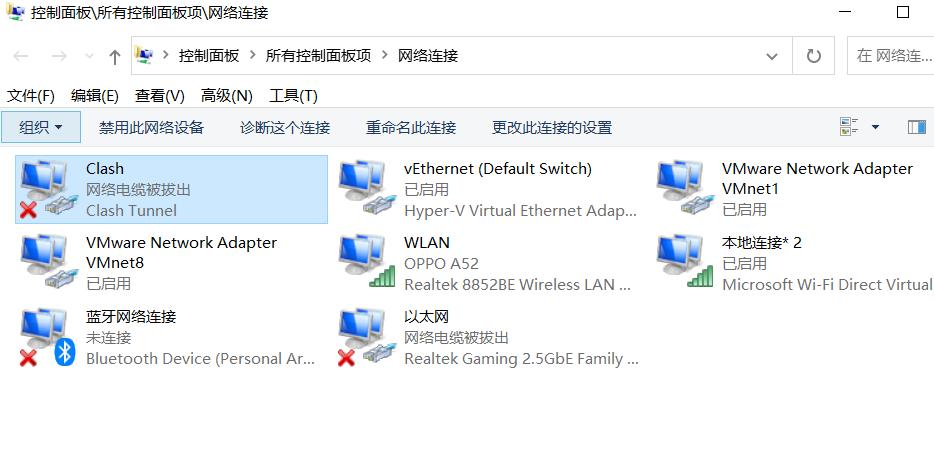
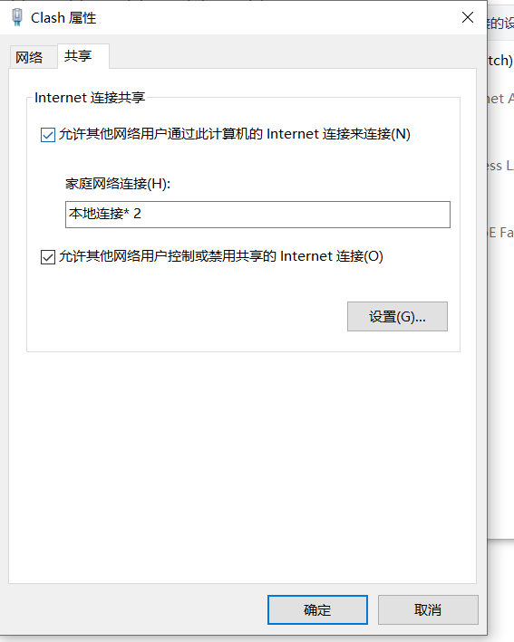

# 074-tun模式代理-虚拟网卡无访问网络权限
## 问题描述
```
    # 无论使用哪种客户端(clash、v2ray、netch、sstap)进行tun模式进行代理都会出现'虚拟网卡 无权限访问网络的问题',
    # 导致tun代理失败，这并不是 客户端的问题...
```
## 解决
### `根治方法`
* `控制面板`，查看`tun模式建立的虚拟网卡`
* 
* `点击共享`，勾选 `允许其他网络用户通过....`，在选中 `本地连接`(类似选项)，确定即可
* 
* `重新启动tun模式即可`
### 透明代理
* ```
    某些情况下，软件可以监测到本机使用tun模式代理，
    但是在路由器上开启tun模式(透明代理)，局域网内所有设备不用任何代理工具，
    都可以上网。
* 开启热点也一样
### 奇淫技巧

* 1.改变当前usb入网方式建立的虚拟网卡，
* ```
    # 就比如: 换另一个手机尝试 usb分享网络；
    # 或者 打开开发者模式，开启usb调试，改变当前usb分享网络建立的虚拟网卡。
* 2.管理器删除当前usb入网方式建立的虚拟网卡(wifi联网也是如此)
```
    # 控制面板----》设备管理器----》网络适配器
    # 选中并删除 对应usb分享网络建立的虚拟网卡。
