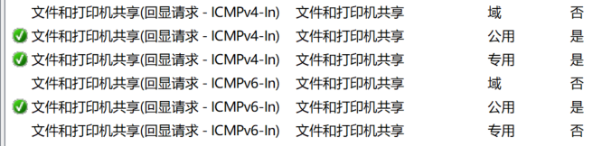

# 解决单边 **ping** 通问题(局域网下)
* ```
    ping 两台主机是否互通时，只能单边 ping通 ，另一台主机无法ping通，
    出现这种现象并不是两个没有建立连接，
    只是能ping通的主机收到发送来ping包没有发出反馈，
## 解决方法
* 打开**防火墙**，点击**高级设置**，进入**入站规则**。
* 找到**文件和打印机共享(回显请求-ICMPv6-ln)**
* 
* **专用ip** 就对应启用专用配置的防火墙规则。
