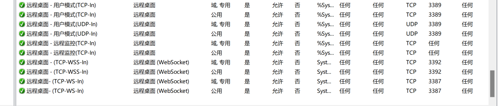
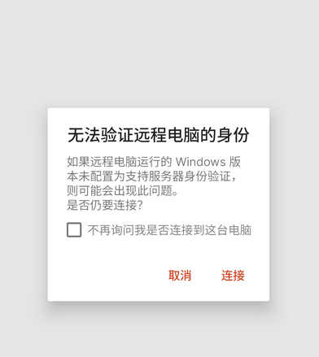

# 076-ngrok内网穿透开放rdp端口
## ngrok 内网穿透开放 3389(rdp port)
1. 官网下载 `ngrok`，并注册账号
2. 复制令牌授权
* ```
    # 在含有ngrok.exe 的目录下执行下面指令
    ngrok config add-authtoken 2UkmNytRStcjGhFQwUWOpHuVhD0_45JneBc9NJULHe8gZ95yv
3. 开放 `3389`
* ```
    ngrok tcp 3389


## 防火墙设置 rdp规则
* 将以下规则全部启用
* 
* 手机远程win(`Microsoft 远程桌面(手机版)`),最好不要点击`不再询问是否连接此电脑`。
* * 


