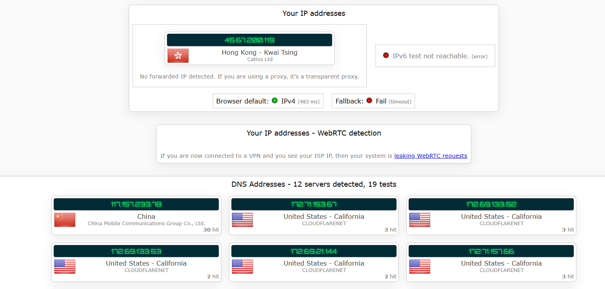
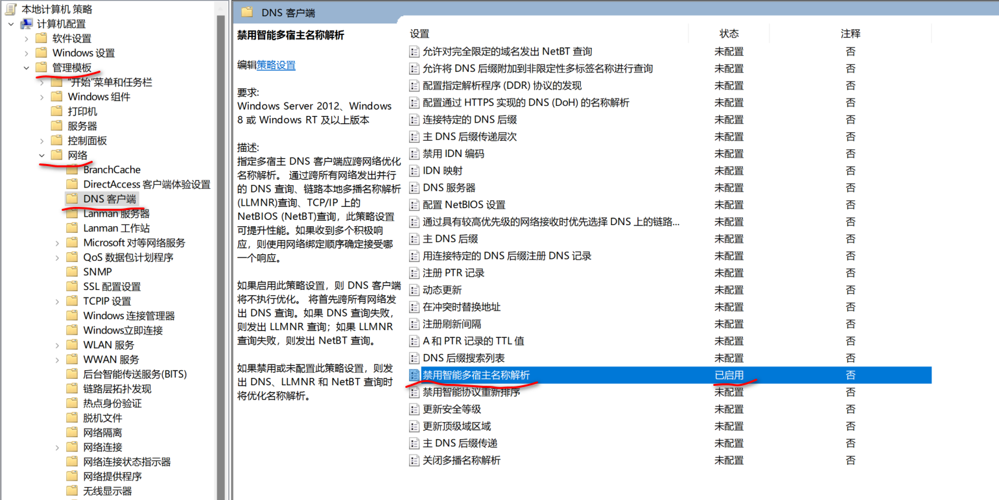

# DNS泄露
* 通过`代理`访问`目标网站`时，电脑给`互联网(dns服务器)`发送了`请求目标网站IP地址(如 google.com是谁的ip)`的明文DNS请求，即为dns泄露。
```
    访问某一网址时，(本地DNS解析)会进行域名解析，
    首先会查找本地的dns缓存，
    不存在，就会发起 DNS请求，转到路由器，路由器没有，
    发向 DNS服务器(运营商提供的)，此时 DNS泄露。
```
## 监测是否泄露
* 访问[ipleak.net](https://ipleak.net)
* 出现中国区域的`DNS服务器`，即为泄露。
* 
## 解决方法
* `禁止本地发送DNS解析请求`，直接将加密后的数据发送到代理服务器，让其自行解析。
### clash对应方法
* 增加分流规则，订阅链接后加入`&config=https://cf.buliang0.cf/clash-rules/nodnsleak.ini`
* 网卡设置国外的`DNS服务器 (1.1.1.1 8.8.8.8)`
* 以上设置即可防止 `系统代理的DNS泄露`
* 对于 `tun模式`代理，启用`fake-ip模式(默认就是)`，在去除 DNS服务器中 `114.114.114.114(国内dns)`
* 在配置win组策略配置(如下图)
* 