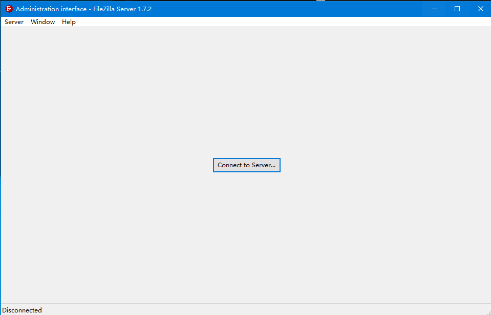
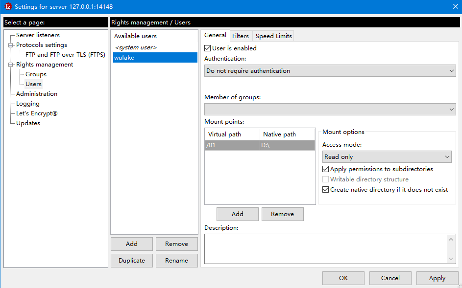

# Filezilla Server基本使用
* 下载[地址](https://filezilla-project.org/).
* 安装，需要用户密码
* 注意 Filezilla server运行在14148端口上(其他会报错)，可以设置监听的ftp端口
## 配置服务并启动
* 初始界面,先连接服务在进行configure
* 在配置界面中，新增用户，原有的system user不可用。
* 确认即可。